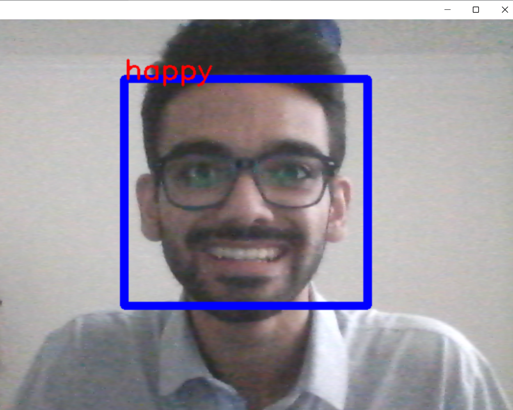
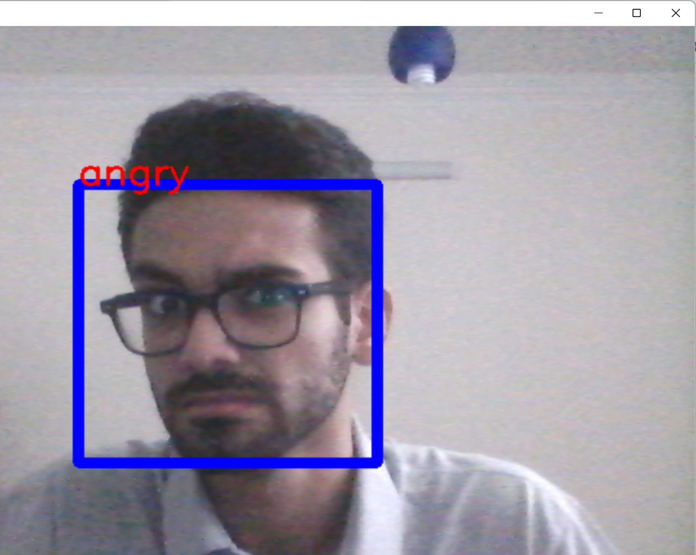

# Emotion Detection
detecting people emotions by their faces using modeling method. MobileNet application is used for training. libraries below have been used for this programm:

- tensorflow keras
- OpenCV
- numpy
- pandas

the results are like this :
 

